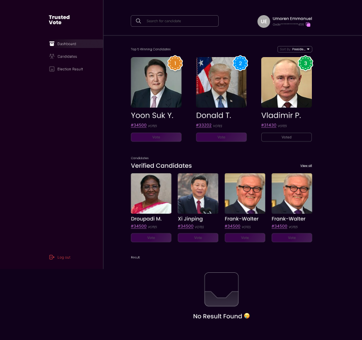

# Secured Online Voting D-Application



## Overview

Our Secured Online Voting Application purpose is to provide voting in secure manner using Hedera’s functionality of SmartContract.
The primary purpose is to provide a transparent voting/polling process. Our team’s objective is to safeguard voter anonymity, prevent double voting and provide a real-time voting tallying.
Key features includes a user friendly UI, secure vote casting using Hedera smart contract based vote validation and tallying.
The project aims to demonstrate the voting process ensuring security and integrity in online elections.

### Frontend

The frontend of this project is built using **React** with **Javascript** and **TypeScript** for type safety, and **Material UI** for a sleek, responsive design.

### Backend

The backend is developed in **JavaScript** with **Express.js**, and it leverages **Hedera Hashgraph** for decentralized identity management and secure voting. The backend also handles user authentication, vote counting, and ensures that all votes are immutably recorded on the Hedera blockchain.

## Features

### Decentralized Identity Management
- **Hedera DID Generation**: Every user has a unique DID (Decentralized Identifier) generated using Hedera, ensuring secure and verifiable identities.

### Secure Voting System
- **Vote Recording on Blockchain**: Votes are securely recorded on the Hedera network, making the voting process tamper-proof and transparent.
- **One Vote per User**: Each user is allowed to vote only once per candidate, enforced by DID verification.

### Transaction Handling
- **Hedera Transaction Fees**: A small transaction fee is deducted when users vote, simulating real-world voting scenarios.

### Election Management
- **Candidate Creation**: Admins can create election candidates, including fields for their name, position, description, and the election status.
- **Vote Counting**: Votes are tracked in real-time, and users can view the current standings of all candidates.

### Filtering and Search
- **Candidate Filtering**: Users can filter candidates based on votes or positions, allowing for easy navigation of election data.

## Installation

### Prerequisites

- Node.js (v18.x or higher)
- NPM or Yarn
- MongoDB
- Hedera Testnet Account

### Backend Setup

1. **Clone the Repository**

    ```bash
    git clone https://github.com/Cooperation-org/Hackathon-app.git
    cd Hackathon-app
    ```

2. **Install Dependencies**

    ```bash
    npm install
    ```

3. **Set Up Environment Variables**

    Create a `.env` file in the root directory with the following content:

    ```plaintext
    PORT=5000
    MONGO_URI=your_mongodb_connection_string
    JWT_SECRET=4e1e8e321bb42547b48a838552147edf5209174d707fcdc9323656e2946ff066
    HEDERA_ACCOUNT_ID=your_hedera_account_id
    HEDERA_PRIVATE_KEY=your_hedera_private_key
    ```

4. **Start the Backend**

    ```bash
    npm run start
    ```

### Frontend Setup

1. **Navigate to the Frontend Directory**

    ```bash
    cd frontend
    ```

2. **Install Dependencies**

    ```bash
    yarn install
    ```

3. **Start the Frontend**

    ```bash
    yarn run dev
    ```

## Usage

### 1. **Creating an Election Candidate**

Admins can create election candidates by sending a POST request to the `/api/election/create-candidate` endpoint with the following JSON payload:

```json
{
  "candidateName": "Peter Ani",
  "position": "Dao President",
  "description": "Committed to positive change in the Dao Ecosystem."
}
```

### 2. Voting for a Candidate

Authenticated users can vote for a candidate by sending a POST request to the `/api/election/vote` endpoint with the following JSON payload:

``` json
{
  "candidateId": "candidate_object_id_here"
}

```

### 3. Listing and Filtering Candidates

Users can view and filter election candidates by sending a GET request to the `/api/election/list-candidates` endpoint. Filters can be applied using query parameters:

**/api/election/list-candidates?filterBy=position&value=President**


### Team

- Peter Ani - Backend & HashGraph Developer
- Amal Ahmed [Moka] - Frontend Developer
- Anuja Chivate - Project Manager & Frontend Developer
- Umoren Emmanuel - Web3 UI/UX Designer